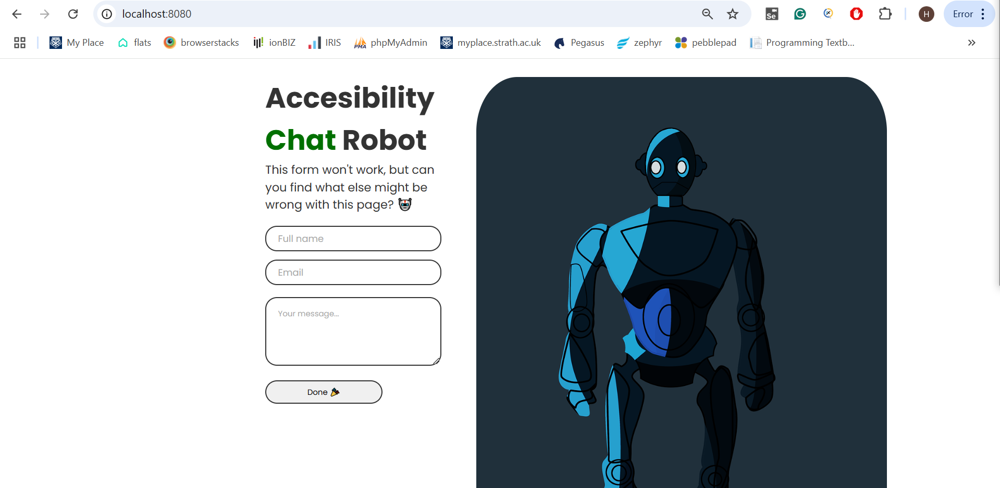

# 📝 The Task - Part 1

# Playwright JavaScript Test Framework

##  Features

- **Cross-browser testing** (Chromium, Firefox, WebKit)
- **Page Object Model (POM)** for better maintainability
- **Data-driven testing** using JSON files
- **Soft assertions** for robust validations
- **Automatic reporting** with Playwright’s test reporter

## Setup Instructions

### **1️⃣ Install Playwright**

```sh
npm install --save-dev @playwright/test 
```

### **2️⃣ Install Required Dependencies**

```sh
npm install dotenv
npm install date-fns
```

## ▶ Running Tests

### **Run all tests**

```sh
npx playwright test
```

### **View Test Report**

```sh
npx playwright show-report
```

# 🎢 The Task - Part 2 (bonus task)

## Accessibility Issue: Low Contrast Placeholder Text&#x20;

## Description

Low contrast with placeholder text on form inputs. Light grey text against a white background breaches AA standards. 

## Details

- **Bug ID:** 1
- **Date Reported:** 04/03/2025
- **Reported By:** [Hardie Brown]
- **Affected Page:** Accessibility Chat Robot (http\://localhost:8080/)
- **Severity:** Medium
- **Priority:** Medium
- **Browser**: Chrome
- **Device**: Desktop

## Steps to Reproduce

1. Run npm start on your  terminal
2. Open browser and navigate to "http\://localhost:8080/"
3. First Name, Email, and Your Message placeholder text has low contrast.

## Expected Behavior

- The text should have **at least a 4.5:1 contrast ratio** as per **WCAG 2.1 AA standards**.

## Actual Behavior

- First Name, Email, and Your Message placeholder text has low contrast against a white background.



---

List of Accessibility issues:

2. &#x20;Missing \<label> Elements for Inputs	Screen readers cannot identify form fields correctly.	Add \<label> elements for Full Name, Email, and Message.
3. No ARIA Roles or Labels for Form Elements	Screen readers may not understand what the fields are for.	Add aria-label attributes to improve accessibility.
4. No alt Text for Robot Image	Screen readers won't describe the robot image.&#x9;


---

